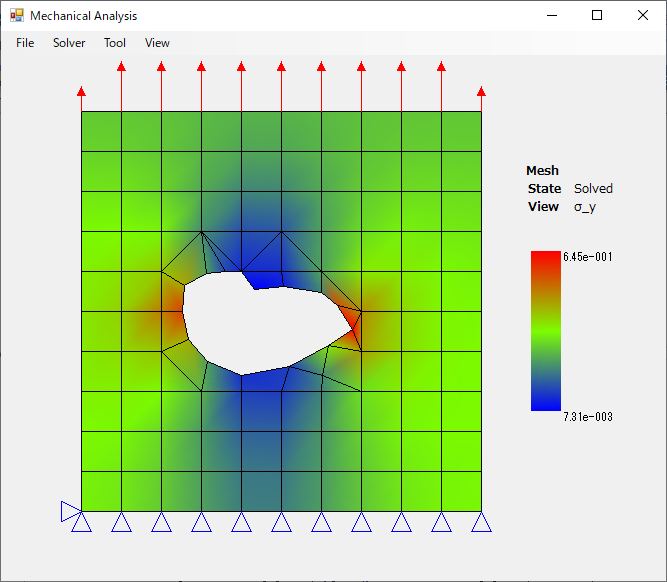

## ---Notice---
If you can't open example mesh file, please change line feed code in the file from LF (for UNIX) to CR LF (for Windows).

# Mechanical Analysis
Two-dimensional elasticity analysis. 
 

## theory 
 
 
 
 
 
See FEM-exmaple/WindowsFormsApp/Mechanics/FEM.cs for the core calculation. 
 
Reference document :  
    有限要素法入門 - 三好俊郎 著 
    有限要素法概説 - 菊池文雄 著 
    計算力学 有限要素法の基礎 - 竹内則雄/樫山和男/寺田賢二郎 共著 

# Mesh Editor
Tool to create mesh for FEM. It can be launched from menu "Tool > Mesh Editor". 
 
 
